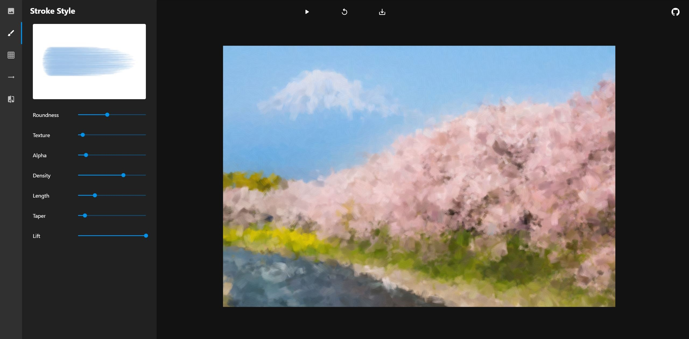

# Paintify

Paintify is a web app for creating paintings using procedurally generated brushstrokes. Brush qualities such as size, direction, roundness, density, length, texture, and more may be adjusted.

## Demo

View the live site [here](https://austinrsands.github.io/paintify/).

## Prerequisites

- Make sure you have [Node](https://nodejs.org/), [Yarn](https://yarnpkg.com/), and [git](https://git-scm.com/) installed on your machine.
- We also recommend using [Visual Studio Code](https://code.visualstudio.com/) with the [ESLint](https://marketplace.visualstudio.com/items?itemName=dbaeumer.vscode-eslint) extension.

## Running the Project

1. Install the dependencies and devDependencies:

   ```sh
   yarn
   ```

2. Serve the app locally in development mode:

   ```sh
   yarn start
   ```

## Scripts

`yarn start` : build the unoptimized client bundle and serve it with hot reload at <http://localhost:1234>

`yarn build` : build the optimized bundle for distribution

`yarn clean` : delete all build artifacts

`yarn deploy` : deploy the project on GitHub Pages
